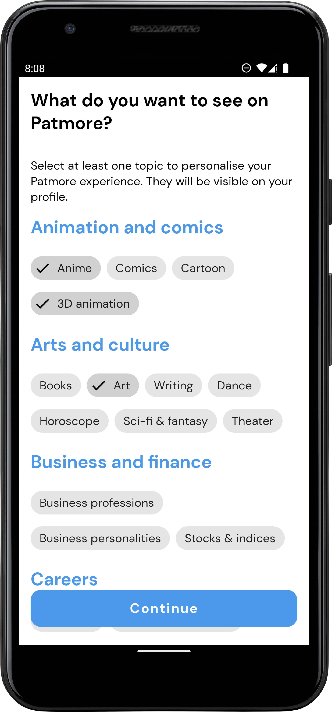
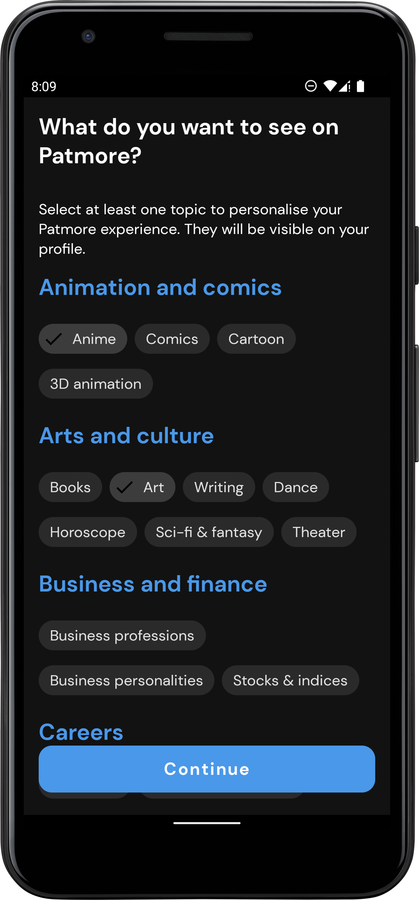
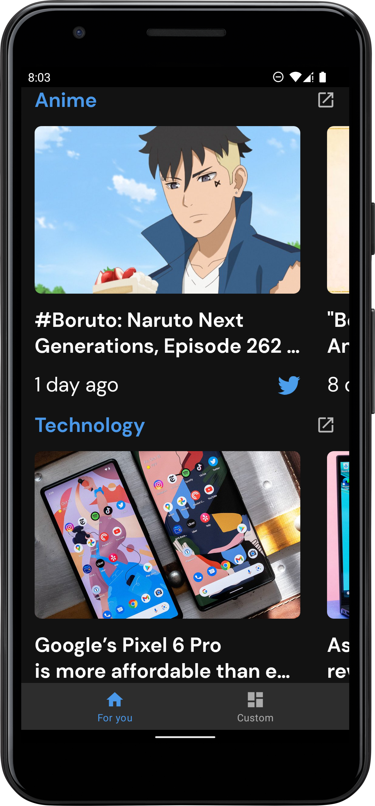
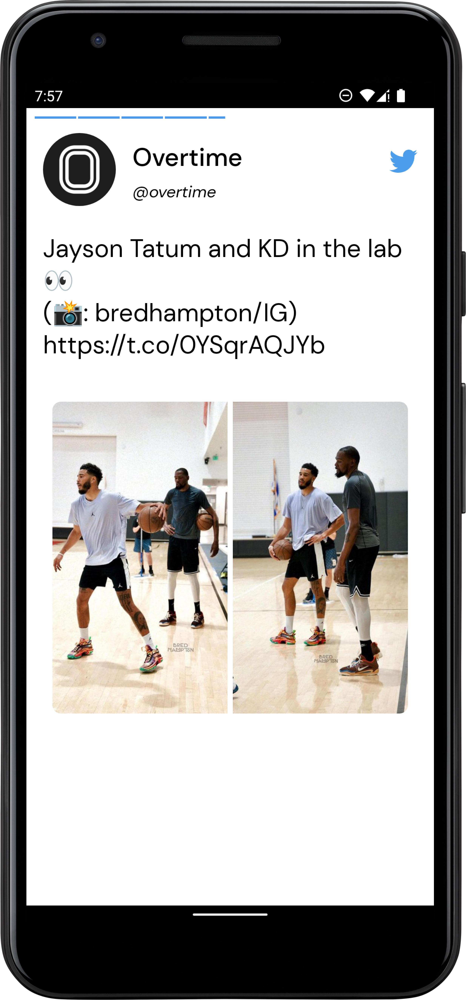
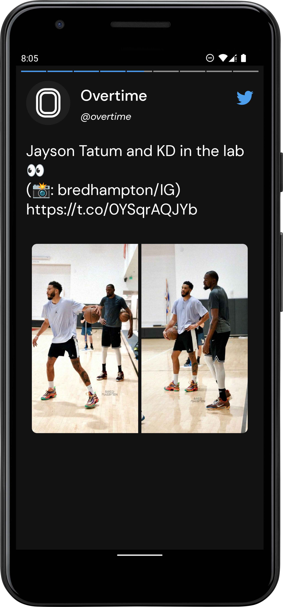

[](https://github.com/jawnpaul/patmore-android/actions/workflows/android_build.yml)

# patmore-android
## _Need help focusing on the things you love on Twitter? Try Patmore!_
Patmore gives users the power to choose to see ONLY tweets around categories they pick.
Users see tweets curated around the categories they selected in a structured format that allows them to scroll through categories and swipe through tweets in each category.
Think Twitter meets Insta stories in a way that helps users quickly take in the most important tweets in categories of their choice in a hyper-focused form. Users can also interact with the product via a [Twitter bot](https://twitter.com/patmoreapp)

The application consumes data from the [Twitter API](https://developer.twitter.com/en/docs/twitter-api)

## Table of Contents

- [Architecture](#architecture)
- [Libraries](#libraries)
- [Process](#process)
- [Testing](#testing)
- [Organisation](#organisation)
- [Extras](#extras)
- [Demo](#demo)

## Architecture

Since the application is expected to scale with multiple developers working on it, I used the Clean architectural principles to build the application. I choose this architecture because it fosters better separation of concerns and testability.

The Application is split into a three layer architecture:

- Data
- Domain
- Presentation

#### Data

The data layer handles the business logic and provides data from the Twitter API. This layer uses the Repository pattern to fetch data from various data sources which in this case is the Twitter API.

#### Domain

The domain layer contains the application specifics logic. It contains interactors/use cases that expose the actions that can be performed in the application.

The UseCases use a ```BaseUseCase``` interface that defines the parameters its taking in and
output and also handles running the UseCases in a background thread leveraging Kotlin Coroutines.


#### Presentation

I used the MVVM pattern for the presentation layer. The Model essentially exposes the various states the view can be in. The ViewModel handles the UI logic and provides data via Android architectural component LiveData to the view. The ViewModel talks to the domain layer with the individual use cases. Jetpack's Data binding is used to bind the data declaratively to the views.

## Libraries

Libraries used in the application are:

- [Jetpack](https://developer.android.com/jetpack)
  - [Viewmodel](https://developer.android.com/topic/libraries/architecture/viewmodel) - Manage UI related data in a lifecycle conscious way
  and act as a channel between use cases and UI.
  - [Data Binding](https://developer.android.com/topic/libraries/data-binding) - support library that allows binding of UI components in layouts to data sources, binds character details and search results to UI.
  - [LiveData](https://developer.android.com/topic/libraries/architecture/livedata) - Provides an observable data holder class.
- [Retrofit](https://square.github.io/retrofit/) - type safe http client and supports coroutines out of the box.
- [Shimmer](https://facebook.github.io/shimmer-android/) - Shimmer provides an easy way to add a shimmer effect to views in the application.
- [Moshi](https://github.com/square/moshi) - JSON Parser, used to parse requests on the data layer for Entities and understands Kotlin non-nullable
and default parameters.
- [okhttp-logging-interceptor](https://github.com/square/okhttp/blob/master/okhttp-logging-interceptor/README.md) - logs HTTP request and response data.
- [kotlinx.coroutines](https://github.com/Kotlin/kotlinx.coroutines) - Library Support for coroutines. I used this for asynchronous programming in order
to obtain data from the network as well as the database.
- [Coil](https://coil-kt.github.io/coil/) - This was used for loading user avatars in the adapter.
- [JUnit](https://junit.org/junit4/) - This was used for unit testing the repository, the use cases and the ViewModels.
- [Mockk](https://mockk.io/) This is a mocking library for Kotlin. I used it to provide test doubles during testing.
- [Truth](https://truth.dev/) - Assertions Library, provides readability as far as assertions are concerned.
- [Hilt](https://github.com/InsertKoinIO/koin) - Dependency injection plays a central role in the architectural pattern used.
For this reason I have chosen Hilt which is built on top of the battle tested DI framework - Dagger 2.

## Process

In general, any particular flow can be said to follow the steps below:
- The view sends an action to the ViewModel
- The ViewModel reaches out to the UseCase/Interactor
- The UseCase via an abstraction layer reaches out to the repository
- The repository decides where to get the data from and returns (mapped to domain representation) either a success or a failure via a Sealed Either class.
- The UseCase gets the returned value and hand it over to the ViewModel
- The ViewModel maps the returned value to the presentation object.
- Finally, the ViewModel creates a view to model the state of the view and hand it over the view leveraging DataBinding.


## Testing

The different layer has various test cases.

The data layer has tests for the repository. To test the repository, test doubles were provided for the API service.

The UseCases were also tested by ensuring the UseCases called the right repository methods.

The presentation layer also has unit tests for the viewmodels.

## Organisation
I decided to organize my code based on features. Since many developers are expected to work on the project, developers can easily spot the folder to work on based on feature. This can also potentially reduce merge conflicts. It also makes it easy for new developers to come on board and if we want, we can easily have developers dedicated to different features of the application.

## Extras
The project uses ktlint to enforce proper code style. Github actions handles continous integration, and runs ktlint and unit tests.


## Installation

Minimum Api Level : 21
compileSdkVersion : 31
Build System : [Gradle](https://gradle.org/)

1. Get a free Twitter API credentials at [https://developer.twitter.com/en/docs/twitter-api/getting-started/getting-access-to-the-twitter-api](https://developer.twitter.com/en/docs/twitter-api/getting-started/getting-access-to-the-twitter-api)
2. Get mixpanel token at [https://developer.mixpanel.com/docs](https://developer.mixpanel.com/docs)
3. Clone the repo
   ```sh
   git clone https://github.com/jawnpaul/patmore-android.git
   ```
4. (OPTIONAL) To build the submission for [chiprdevchallenge](https://chirpdevchallenge.devpost.com/)
    ```sh
   git checkout chirpdevchallenge
   ```
5. Enter your keys in `local.properties`
   ```sh
   TWITTER_BEARER_TOKEN=<Enter your Twitter Bearer Token>
   TWITTER_CLIENT_ID=<Insert your Twitter client ID>
   PATMORE_BASE_URL=https://patmore.herokuapp.com/
   TWITTER_BASE_URL=https://api.twitter.com/2/
   MIXPANEL_DEV_TOKEN=<Enter your mixpanel token>
   MIXPANEL_PROD_TOKEN=<Enter your>
   TWITTER_CALLBACK_URL=https://patmore.app
    ```

## Demo
Try it out on [Google playstore](https://play.google.com/store/apps/details?id=com.patmore.android)

Find below screenshots of the application

|||
|:----:|:----:|

|||
|:----:|:----:|

|||
|:----:|:----:|

## License

MIT

**Free Software, Hell Yeah!**
